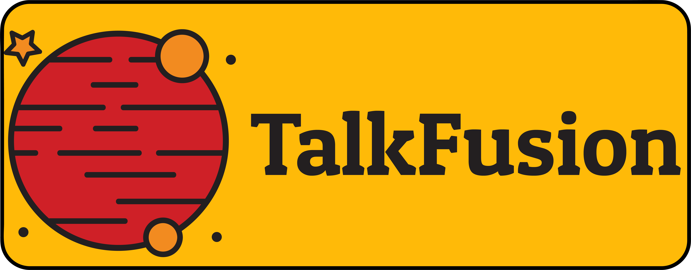

## **Table of contents:**
- [Description](#description)
- [Features](#features)
- [Contributors](#contributors)
- [Usage](#usage)
- [Gallery](#gallery)

# Description
Made using ASP.NET MVC in Visual Studio.

Talkfusion is a .NET-based collaborative workplace platform.

# Features

Tasks Completed : 14/14

- [X] Implement four types of users: unregistered visitor, registered user, moderator, and administrator.
  
- [X] Unregistered users can view the home page and login/register forms.
  
- [X] Home Page.

- [X] Search Bar.
  
- [X] Pagination.

- [X] Each team must have a mandatory name and description upon creation.
  
- [X] Teams divided into dinamically created categories managed by the administrator.
  
- [X] Registered users can create new teams or join existing ones.
  
- [X] The user creating a team becomes the default moderator.

- [X] Moderators can accept new members, revoke members with inappropriate behavior, and grant moderation rights to other team members. 

- [X] Team members can add text messages, images, and embedded videos from other platforms. Additionally, they can edit and delete their own messages. 

- [X] List of team members.

- [X] Registered users can be part of multiple teams. A list is shown of the teams they belong to.

- [X] Administrator has authority to delete content, manage user rights, and ensure platform integrity.

# Contributors
- [Huma Stefan](https://github.com/Steven23X)
- [Razvan Gabroveanu](https://github.com/GabroveanuRazvan)

# Usage
- Simply clone the project repository from GitHub:
  
   ```bash
    git clone https://github.com/FMIProjects/TalkFusion.git
   ```
- Create Database in Package Manager Console:
   ```bash
    Update-Database
   ```
- Run it.

# Gallery
TBA